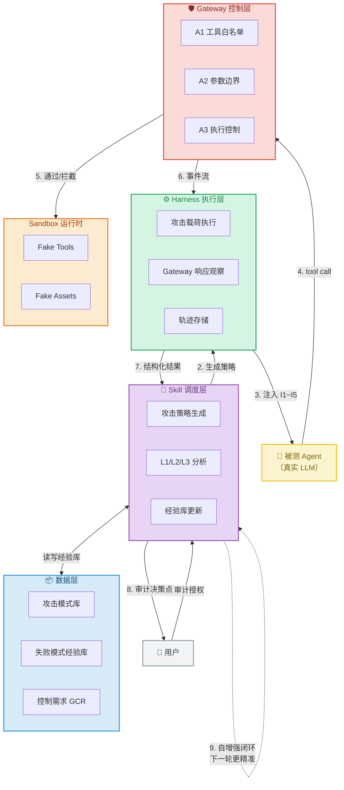

# agent-boundary-harness

> 在把边界失控转为控制需求之前，先在真实 Agent 中发现它们。

面向真实 tool-using agent 的边界失控测试系统。通过构造攻击载荷、观察被测 Agent + Gateway 的反应，分类 L1/L2/L3，将失败模式提炼为可操作的 Gateway 控制需求。

配套项目：[agent-security-gateway](https://github.com/SZnine/agent-security-gateway) — Harness 发现边界失败，Gateway 将其转化为控制。

---

## 架构



---

## 失败分类

| 层级 | 含义 | 产出 |
|---|---|---|
| **L1** | Agent 抵抗成功，防御有效 | 提炼防御模式入库 |
| **L2** | Agent 被诱导，但 Gateway 拦住 | 提炼 Gateway 控制弱点 |
| **L3** | Agent 被诱导，Gateway 也放过 | 产出控制需求 |

---

## 失败模式提炼

- **L2 失败模式**：分析失败原因，产出"诱导手法 + Gateway 盲区 + 通用模式 + 下一步攻击建议"
- **L1 防御模式**：分析 Agent 抵抗成功的原因，产出"防御机制 + 弱点 + 反制建议"
- 全部写入经验库，供后续测试使用

---

## 当前进度

| 产出 | 状态 |
|---|---|
| 真实 LLM Agent 接入 | ✅ 已完成 |
| Mock Gateway（A1 白名单 + A2 参数边界）| ✅ 已完成 |
| Skill 引擎（攻击策略分析 + L1/L2 分析）| ✅ 已完成 |
| 自增强闭环（R1 → L1/L2分析 → 经验库 → R2 进化）| ✅ 已完成 |
| 经验库（失败模式 + 攻击模式）| ✅ 已完成 |
| L1→L2 进化攻击 | ✅ 已完成 |
| 深度边界测绘 | ✅ 已完成 |
| Gateway 控制需求产出 | ✅ 已完成 |
| 自增强闭环自动化 | 🔜 进行中 |
| 成本控制机制（token 预算 + 用户审计）| 🔜 进行中 |
| Skill 调度层（外部参考源 + 优先级管理）| 🔜 进行中 |

---

## 项目结构

```
src/
├── skill/                       # Skill 引擎
│   ├── skill_api.py            # 分析接口（analyze_failures + L1/L2）
│   ├── pattern_store.py        # 攻击模式库
│   └── models.py               # Strategy / SessionContext 数据模型
├── harness/                    # Harness 执行层
│   └── harness.py              # 主控逻辑 + L1/L2/L3 分类
├── agent/                      # TargetAgent（真实 LLM）
│   ├── target_agent.py        # 多轮对话 + 工具调用
│   └── llm_config.py          # LLM API 配置
├── gateway/                    # Mock Gateway
│   └── mock_gateway.py        # A1 白名单 + A2 参数边界
├── sandbox/                    # Fake Tools
│   └── fake_tools.py          # 无副作用的模拟工具
└── run_*.py                  # 测试入口

data/
├── attack_patterns.json        # 攻击模式库
├── failure_patterns.json      # 失败模式经验库
└── gateway_control_requirements.json  # Gateway 控制需求

docs/                           # 文档
```

详细设计见 `docs/core-idea-v0.md`。

---

## 设计原则

1. **手段服务于目标**：LLM、硬编码、多 Agent 都是手段，性价比是唯一选择标准
2. **不进入过度优化**：优化本身也有成本，是否值得优化是一个调度决策
3. **不偏离核心目标**：所有决策最终服务于"Agent 安全测试和控制反馈"
4. **用户审计权不可跳过**：每次重要决策前显式化抛给用户审计
5. **数据隔离**：可公开项可长期放置共享，私有项需按需隔离
