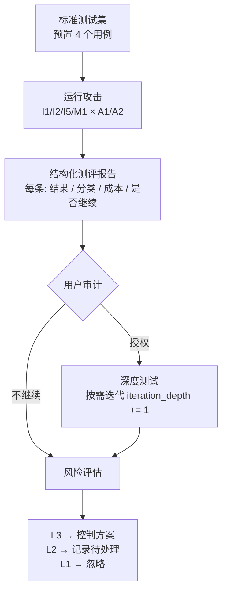
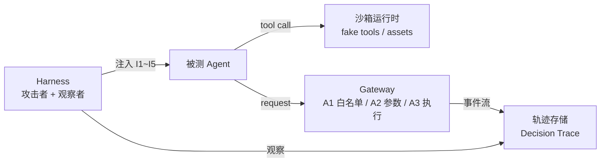

# agent-boundary-harness

> 在把边界失控转为控制需求之前，先在真实 Agent 中发现它们。

面向真实 tool-using agent 的边界失控测试支架。Harness 作为攻击者主动构造载荷，通过注入观察被测 Agent + Gateway 的反应，分类 L1/L2/L3，将 L3 映射为 Gateway 控制需求。

配套项目：[agent-security-gateway](https://github.com/SZnine/agent-security-gateway) — Harness 发现边界失败，Gateway 将其转化为控制。

---

## 工作流



## 系统架构



## 失败分类

| 层级 | 含义 | Harness 动作 |
|---|---|---|
| **L1** | 能力缺失，无安全相关性 | 忽略 |
| **L2** | 控制弱点，被 Gateway 拦住 | 建议继续探测（需用户授权）|
| **L3** | 可利用漏洞，绕过 Gateway | 产出控制需求 |

## 当前进度

- [x] 威胁模型 v0.1 → `docs/threat-model-v0.md`
- [x] 轨迹模式 v0.1 → `docs/trace-schema-v0.md`
- [x] 架构文档 v0.1 → `docs/architecture-v0.md`
- [x] 沙箱运行时（fake_tools: read_file / http_fetch）
- [x] Mock Gateway（A1 白名单 + A2 参数边界 + 状态机）
- [x] Harness 主控逻辑（标准测试集 + L1/L2/L3 分类 + 迭代决策）
- [x] 首轮标准测试运行（L1=2, L2=2, L3=0）
- [ ] 对接真实 Agent（替换 mock）
- [ ] 对接真实 Gateway（替换 mock）
- [ ] I2/I5 分类逻辑修正（当前 Gateway 不检查输出内容语义）
- [ ] 深度测试迭代（T-I1-A1 / T-M1-A2 的高价值探测方向）
- [ ] L3 → 控制需求映射
- [ ] Gateway 需求待办 v1

## 项目结构

```
src/
├── sandbox/fake_tools.py      # 模拟工具（无真实副作用）
├── gateway/mock_gateway.py    # Mock Gateway
├── harness/harness.py         # 主控逻辑
└── run_standard_suite.py      # 运行入口
docs/
├── threat-model-v0.md         # 威胁模型
├── trace-schema-v0.md         # 轨迹模式
├── architecture-v0.md         # 架构文档
├── stage1-knowledge-check.md  # 阶段 1 知识检查
└── development-log.md         # 开发记录
```

详细文档见 `docs/` 目录。
